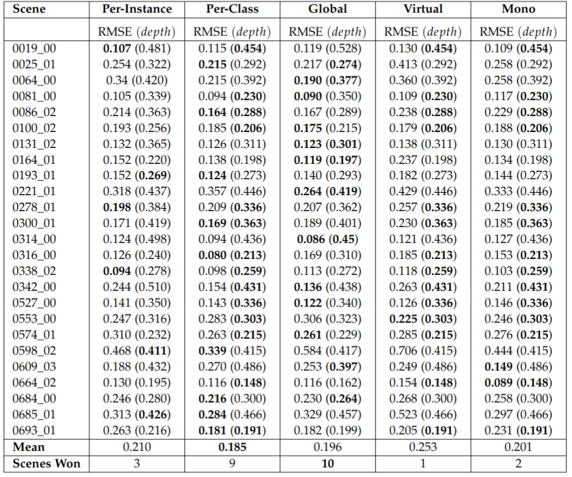

[](https://opensource.org/licenses/MIT)
[](https://www.python.org/downloads/release/python-270/)

## <p align="center">Scale-Aware Monocular Depth Prediction for SLAM in Canonical Space</p>

The full thesis is available as a PDF. [Download or view it here.](https://drive.google.com/file/d/12_ByScvsCKU3ozXadiCrp-S--ZDDuMbR/view?usp=sharing) The code will become public later. 

<p align="center">
 
</p>

## Overview of the results 
The Scale-Aware method improves SLAM optimization by incorporating  scale constraints into the Bundle Adjustment optimization step.</b> 
<p align="center">
ScanNet Absolute Trajectory Error (ATE) in [m] </p>
<p align="center">

</p>

-------
#### Citation
If you find my thesis useful in your research, please consider citing:

```bib
@thesis{Petropoulakis2020,
    author      = {Petropoulakis Panagiotis, S. B. Laina, S. Schaefer, J. Jung, and S. Leutenegger},
    title       = {Scale-Aware Monocular Depth Prediction for SLAM in Canonical Space},
    type        = {mscthesis},
    url         = {https://github.com/PetropoulakisPanagiotis/thesis/},
    institution = {TUM School of Computation, Information and Technology},
    year        = {2024},
}
```

