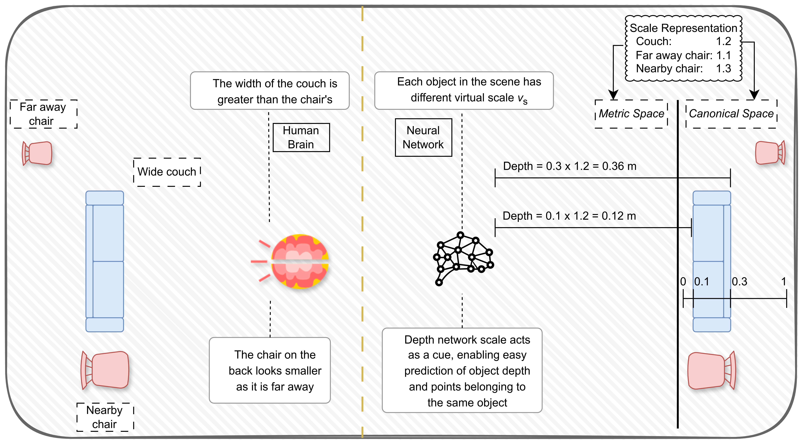

[](https://opensource.org/licenses/MIT)
[](https://www.python.org/downloads/release/python-270/)

## <p align="center">Scale-Aware Landmark-based SLAM in Canonical Space</p>

<p align="center">
 
</p>
<br /> <br />

----

## Installation
#### Depth Pipeline
```
conda create --name scale-env python=3.8
conda activate scale-env
conda install cudatoolkit=11.3
conda install -c nvidia cuda-nvml-dev
conda install cuda -c nvidia/label/cuda-11.3.0
conda install pytorch==1.10.0 torchvision==0.11.0 torchaudio==0.10.0  -c pytorch
pip install matplotlib tqdm tensorboardX open3d matplotlib tqdm timm tensorboard pandas scipy tensorflow[and-cuda]
pip install -U openmim
mim install mmcv==2.0.0
```

#### Scale-Aware Pipeline
Advice: use our instructions to install third-party packages for your convenience. 

1) Step: install [pangolin](https://github.com/uoip/pangolin)
 
```
cd scale-aware-slam 
conda install -c conda-forge libstdcxx-ng=12
cd pangolin
mkdir build
cd build
cmake -DPYBIND11_PYTHON_VERSION=3.8 ..
make -j8
cd ..
python setup.py install
```
2) Step: install [g2opy](https://github.com/uoip/g2opy)
```
cd scale-aware-slam 
pip install pybind11 setuptools==58.2.0 opencv-contrib-python PyOpenGL
cd g2opy
mkdir build
cd build
cmake -DPYBIND11_PYTHON_VERSION=3.8 ..
make -j8
cd ..
python setup.py install
```
## Datasets preparation 
To prepare the datasets ScanNet and NYUv2 we have used and extended the repository [nicr-scene-analysis-datasets](https://github.com/TUI-NICR/nicr-scene-analysis-datasets) to our needs.

* NYUv2

```
wget http://horatio.cs.nyu.edu/mit/silberman/nyu_depth_v2/nyu_depth_v2_labeled.mat
python3 helpers/extract_official_train_test_set_from_mat.py nyu_depth_v2_labeled.mat splits.mat ../../../datasets/nyu_depth_v2/official_splits/
```

* Scannet
First, install the original data using the script:
```
python3 download.py -o /usr/stud/petp/storage/user/petp/datasets/scannet/
Then prepare the dataset to our format with 13 classes:
```

```
cd nicr_sa_prepare_dataset
python -m pip install .[withpreparation,with3d] --user && pip install --upgrade numpy && pip install markupsafe==2.0.1 && pip install werkzeug==2.0.3
nicr_sa_prepare_dataset scannet /usr/stud/petp/storage/user/petp/datasets/scannet/data /usr/stud/petp/storage/user/petp/datasets/scannet/data_converted
```


## Checkpoints 

## Run

Depth 
slam
evaluation
depth refinement 

-------
#### Citation
If you find my thesis useful in your research, please consider citing:

```bib
@thesis{Petropoulakis2020,
    author      = {Petropoulakis Panagiotis, S. B. Laina, S. Schaefer, J. Jung, and S. Leutenegger},
    title       = {Scale-Aware Landmark-based SLAM in Canonical Space},
    type        = {mscthesis}
    url         = {https://github.com/PetropoulakisPanagiotis/BSc_thesis},
    institution = {TUM School of Computation, Information and Technology},
    year        = {2024},
}
```
